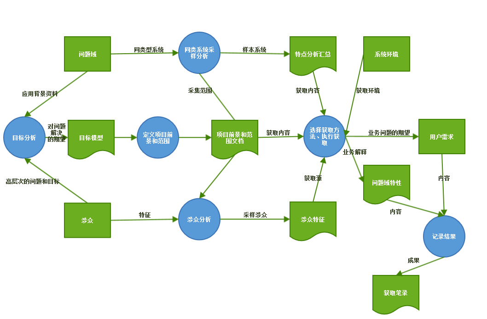
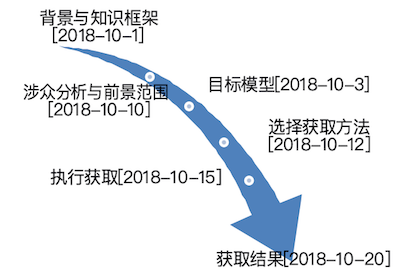

# 需求获取计划书

**南京大学软件学院16级本科**

2018年10月20日

161250024 方渤镕

161250041 侯韵晗

161250029 葛    宇

161250171 徐一舟

[TOC]

### 1.引言

#### 1.1 编制目的

​	智能课程表系统是一个主要面向高校学生群体的课程、日程安排系统，主要提供查看课程表、安排日程、分析日程等功能特性。

​	本文档是需求小组在进行需求工程实践中在需求获取阶段的产物，作用于整个需求获取阶段，主要描述了需求获取阶段的全程计划安排，作为执行指南和后续跟踪管理的依据。

#### 1.2 词汇表

| 用语     | 解释       |
| -------- | ---------- |
| MPre     | 面谈准备   |
| M        | 面谈       |
| Goal     | 目标       |
| Stkhd    | 涉众       |
| V&S      | 前景和范围 |
| MRevl    | 面谈分析   |
| Refine   | 精化       |
| Prttp    | 原型       |
| Doc      | 文档       |
| CheckPre | 评审准备   |
| Check    | 评审       |

### 2.需求获取计划概要

#### 2.1 需求获取活动

​	在进行了对上一阶段形成的目标模型的进一步审查和分析之后，综合考量系统的高层目标，系统的涉众和应用场景，我们认为在整个需求获取活动中应该进行以下活动：

- 研究应用背景，分析现有类似系统，建立初始知识框架
- 分析系统高层目标，建立目标模型
- 寻找相关涉众，进行涉众分析和涉众选择
- 根据目标模型，涉众特点，选择具体获取方法
- 先行确定获取活动的主题和内容，设定场景
- 分析用户的高（深）层目标，理解用户的意图
- 对需求获取具体活动的结果进行记录，分析和汇总
- 结合场景方法，进行用例分析，获得阶段制品即用例文档和用户需求列表

#### 2.2 需求获取流程

#### 

#### 2.3 需求获取时间轴

### 3.需求获取各阶段明细

#### 3.1 研究应用背景，建立知识框架

​	需求小组首先对大学生的课程、日程安排状况进行了分析，选择了部分同类日程系统进行了使用和分析，完成了对应用背景的研究和知识框架的建立。

#### 3.2 目标分析，获取项目前景和范围

小组在应用背景的基础上进行了简单的问题分析，由问题入手，得到了高层次的系统目标，然后通过目标模型的分析方法，进行了目标建模，其间进行了基于目标的涉众分析并且最终形成了项目前景和范围文档，具体参见Stage1中的《项目前景与范围分析文档》

#### 3.3 选择获取方法

##### 3.3.1 。。。

##### 3.3.2 。。。

#### 3.4 执行获取

##### 3.4.1 获取计划

##### 3.4.2 甘特图

### 4.跟踪与反馈

### 5.附录